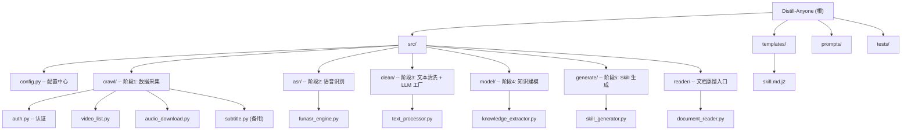

# Distill-Anyone -- AI 辅助编程约定

> 本文件给 Claude Code / Cursor / Copilot 等 AI 编程助手阅读。修改本项目前请先了解以下事项。

## 变更记录 (Changelog)

| 日期 | 变更 |
|---|---|
| 2026-04-16 | 初始化架构师扫描：重构 CLAUDE.md，生成 `.claude/index.json`，补充架构总览、模块结构图、测试策略、编码规范等章节 |
| 2026-04-16 | 新增自动登录：`src/crawl/auth.py`（二维码扫码 + 凭证缓存），`login` CLI 命令，`crawl` 改用 `get_credential()` 三级策略 |
| 2026-04-17 | 新增文档蒸馏：`src/reader/document_reader.py`（PDF/DOCX/TXT → cleaned JSON），`distill` CLI 命令，复用阶段 4-5 生成 SKILL.md |
| 2026-04-21 | 架构师扫描：补齐模块级 CLAUDE.md，校准根级索引 |
| 2026-04-22 | v0.3 大版本：`src/reader/` 章节模块化 + `src/rag/` chunks 输出 + `main.py fuse/chunks` 命令 + DeepSeek-R1 / 第三方代理 JSON 输出兼容 + `BloggerProfile.sources` schema 升级 + jinja2 模板缩进 bug 修复 + 单元测试套件（共 104 用例）|
| 2026-04-23 | SKILL.md 输出加时间戳防覆盖（`output/{name}-{YYYYMMDD-HHMMSS}.skill.md`）；`asr` 命令新增 `--delete-audio/--keep-audio` + `--watch/--watch-interval` 支持边下边转写释放磁盘；`crawl` 把 `transcripts/` 完整的 BV 算入「已处理」避免重复下载；`_safe_json_loads` 升至 7 轮（含 Python 字面量替换 + 缺值补 null）+ LLM 失败自动 dump 到 `data/llm_debug/` |

---

## 项目愿景

Distill-Anyone 是一个 **B站知识区 UP 主视频内容蒸馏工具**，将视频内容通过 5 阶段流水线（爬取 -> ASR -> 清洗 -> 知识建模 -> SKILL.md 生成）转化为可供 AI 助手使用的结构化知识文件。输出格式对齐 [女娲.skill](https://github.com/alchaincyf/nuwa-skill) / [张雪峰.skill](https://github.com/alchaincyf/zhangxuefeng-skill) 风格。

项目提供两条入口：
- **视频路径**：`crawl → asr → clean → model → generate`（B 站 UP 主）
- **文档路径**：`distill`（PDF/DOCX/TXT 直接复用阶段 4-5）

---

## 架构总览

```
5 阶段流水线 + 文件系统作为中间态（JSON 解耦，幂等，断点续传）

 crawl ──> asr ──> clean ──> model ──> generate
   |         |        |         |          |
 audio/   transcripts/ cleaned/ knowledge/ output/*.skill.md
 video_list.json              blogger_profile.json

                 ↑
 distill（文档路径）→ reader/document_reader 直接产出 cleaned/
```

| 层级 | 组件 | 作用 |
|---|---|---|
| CLI | `click` + `rich` | 子命令、进度条、彩色输出 |
| 爬取 | `bilibili-api-python` + `yt-dlp` | 视频列表 / 音频下载 |
| ASR | `funasr` + `torch` | 语音转文字（paraformer-zh，CUDA/MPS/CPU 三级回退） |
| 文本 | 正则 + LLM（Claude/OpenAI/Qwen/DeepSeek/Ollama） | 口语清洗 + 主题切分 |
| 建模 | LLM + `dataclasses` | 知识提取 + 画像合成（nuwa-skill 方法论） |
| 模板 | `jinja2` | SKILL.md 渲染 |
| 文档 | `python-docx` + `PyMuPDF` | 非视频素材蒸馏入口 |
| 配置 | `python-dotenv` + `pydantic` | `.env` -> 校验 -> 注入 |

---

## 模块结构图



---

## 模块索引

| 模块路径 | 职责 | 入口/关键类 | 文档 |
|---|---|---|---|
| `main.py` | CLI 入口，7 个子命令（login/crawl/asr/clean/model/generate/distill）+ `run` 编排 | `cli()` (click.group) | -- |
| `src/config.py` | 配置管理：`.env` 加载 + Pydantic 校验 | `load_config() -> AppConfig` | -- |
| `src/crawl/` | 阶段 1：认证、视频列表、音频下载、字幕（备用） | `get_credential()`, `run_crawl()`, `download_audio()` | [CLAUDE.md](./src/crawl/CLAUDE.md) |
| `src/asr/` | 阶段 2：FunASR 封装 + 设备三级回退 + OOM 重试 | `FunASREngine.transcribe()` | [CLAUDE.md](./src/asr/CLAUDE.md) |
| `src/clean/` | 阶段 3：规则清洗 + LLM 主题切分 + **LLM 客户端工厂** | `TextProcessor`, `create_llm_client()` | [CLAUDE.md](./src/clean/CLAUDE.md) |
| `src/model/` | 阶段 4：知识提取 + 画像合成 + JSON 5 轮容错 | `KnowledgeExtractor`, `BloggerProfile`, `_safe_json_loads` | [CLAUDE.md](./src/model/CLAUDE.md) |
| `src/generate/` | 阶段 5：Jinja2 模板渲染 SKILL.md | `SkillGenerator.generate_and_save()` | [CLAUDE.md](./src/generate/CLAUDE.md) |
| `src/reader/` | 文档蒸馏入口：PDF/DOCX/TXT → cleaned JSON | `document_to_cleaned()`, `read_document()` | [CLAUDE.md](./src/reader/CLAUDE.md) |
| `templates/skill.md.j2` | SKILL.md Jinja2 模板（nuwa-skill 风格） | -- | 见 `src/generate/CLAUDE.md` |
| `tests/` | `auth.py` + `audio_download.py` 单元测试（pytest） | `tests/test_auth.py`, `tests/test_audio_download.py` | -- |

---

## 运行与开发

### 必读文档

- **需求层面**: `README.md`
- **架构与契约**: `DEVELOPMENT.md` -- **修改代码前必读，它定义了每个阶段的 JSON schema**
- **本文件**: 本项目的硬性约定和反模式
- **模块细节**: 各模块下 `CLAUDE.md`（见上表链接）

### 环境

- macOS + venv（目录名 `Distill-Anyone/`，已 .gitignore；Python 3.11）
- PyTorch 2.8.0（pip 安装，支持 MPS）
- ffmpeg via Homebrew（`/opt/homebrew/bin/ffmpeg`）
- yt-dlp 需在 PATH 中（`pip install yt-dlp` 或 Homebrew）

### 快速命令

```bash
# 一键全流程（B 站路径）
python main.py run --uid <uid> --max-videos 20 --llm deepseek

# 分步运行
python main.py login              # 扫码登录（可选，首次运行时自动触发）
python main.py crawl --uid <uid>
python main.py asr
python main.py clean --llm deepseek
python main.py model --llm deepseek
python main.py generate

# 选择阶段
python main.py run --stages 3-5 --llm deepseek

# 小样本验证
python main.py run --uid <uid> --max-videos 2

# 文档蒸馏（文档路径）
python main.py distill --file /path/to/book.pdf --name "张三" --llm deepseek
```

### 配置

复制 `config.example.env` 为 `.env`，填写 B 站 Cookie（可留空走扫码）和 LLM API Key。支持 5 种 LLM 后端：claude / openai / qwen / deepseek / ollama（本地免费）。

---

## 测试策略

**当前状态**：`tests/` 目录存在，使用 pytest。覆盖范围有限：

| 测试文件 | 覆盖对象 | 备注 |
|---|---|---|
| `tests/test_auth.py` | `src/crawl/auth.py`：`save_credential` / `load_cached_credential` / `get_credential`（三级策略） | 全程用 mock 隔离 `bilibili_api` |
| `tests/test_audio_download.py` | `src/crawl/audio_download.py`：`generate_cookies_file`（Netscape 格式、7 列校验） | 未测 subprocess 分支 |

跑测试：
```bash
pytest tests/ -v
```

**未覆盖（高价值补齐点）**：
- `_safe_json_loads`（`src/model/knowledge_extractor.py`）5 轮修复场景
- `check_*_integrity` 系列（四个阶段共 4 个函数）
- `parse_stages`（`main.py`）
- `src/clean/text_processor.py::remove_filler_words` 中英混合边界
- 端到端：小样本 `python main.py run --uid <uid> --max-videos 2`

---

## 编码规范（硬规则）

1. **中间产物 schema 是契约**。改 dataclass 字段 / JSON key 前，先查 `DEVELOPMENT.md` 第 2 节确认下游谁在消费。
2. **Prompt 存在 `.py` 文件底部**，不在 `prompts/` 目录。`prompts/*.txt` 是只读参考。修改实际 Prompt 改 `src/clean/text_processor.py` 和 `src/model/knowledge_extractor.py` 底部的常量。
3. **断点续传依赖完整性校验函数**：`check_audio_completeness` / `check_transcript_integrity` / `check_cleaned_integrity` / `check_knowledge_integrity`。新增 dataclass 字段时考虑是否应纳入校验。
4. **重依赖延迟导入**。`torch`/`funasr`/`anthropic`/`openai`/`docx`/`fitz` 绝对不要在模块顶部 import，必须放在函数内，否则 CLI 启动会变慢几秒。
5. **LLM 供应商若兼容 OpenAI 协议，复用 `OpenAILLMClient`**。只改 `config.py` + `create_llm_client` 里的 `provider_map` 即可，不要新写 Client 类。
6. **日志用 `rich.console`**，不用 `print`。颜色约定：`[blue]` 进行中 / `[green]` 成功 / `[yellow]` 警告 / `[red]` 错误 / `[dim]` 细节。
7. **设备三级回退**：CUDA -> MPS -> CPU。改 ASR 相关代码请保持这个顺序。
8. **失败不中断批处理**。单视频 try/except，循环继续，统计成功率。
9. **SKILL.md 模板与女娲/张雪峰.skill 格式对齐**。修改 `BloggerProfile` dataclass 必须同时改 5 处：(a) dataclass 本身、(b) `PROFILE_SYNTHESIS_PROMPT` 里的 JSON schema、(c) `merge_knowledge()` 里的 `data.get()` 读取、(d) `skill_generator.py` 的 `template.render()` 传参、(e) `templates/skill.md.j2` 模板引用。漏任何一处会导致字段静默丢失。
10. **模板所有新字段必须用 `` 守护**。老 `blogger_profile.json` 缺字段时，对应节块自动隐藏，不报错。

### 反模式（不要做）

- 在 `src/` 顶部 `import torch`
- 把路径硬编码（`"data/audio"`），应走 `config.audio_dir`
- 修改 Prompt 时删掉 JSON schema 注释
- 新增 BloggerProfile 字段但不更新 `templates/skill.md.j2`
- 用 `print`、用 `assert` 做用户输入校验
- 把 `.env` 或 cookies 写入代码或提交到 git
- 在阶段4的画像合成里把所有视频一股脑塞给 LLM（上下文爆炸）-- 坚持 `[:50]` 截断
- 改 `mental_models` schema 但忘了同步 `PROFILE_SYNTHESIS_PROMPT` 里的 JSON 样例（LLM 会按老 schema 输出）
- 给模板加新节但没用 `` 守护（老画像渲染会留一堆空白标题）

### 改完后

- 更新 `DEVELOPMENT.md` 对应章节
- 在 `DEVELOPMENT.md` 第 13 节变更记录追加一行
- 更新对应模块的 `src/<module>/CLAUDE.md` 与根级 Changelog
- 运行小样本验证：`python main.py run --uid <uid> --max-videos 2`

---

## AI 使用指引

### 关键数据契约

所有阶段间通过 JSON 文件解耦，schema 定义在 `DEVELOPMENT.md` 第 2 节。修改任何 dataclass 字段前必须先确认下游消费者：

| 数据文件 | 产出者 | 消费者 |
|---|---|---|
| `data/.credentials.json` | `crawl/auth.py` | `crawl/auth.py::get_credential` |
| `data/video_list.json` | `crawl/video_list.py` | `main.py::crawl`, `main.py::asr` |
| `data/audio/{bvid}.wav` | `crawl/audio_download.py` | `asr/funasr_engine.py` |
| `data/transcripts/{bvid}.json` | `asr/funasr_engine.py` | `clean/text_processor.py` |
| `data/cleaned/{bvid}.json` | `clean/text_processor.py` **或** `reader/document_reader.py` | `model/knowledge_extractor.py` |
| `data/knowledge/{bvid}.json` | `model/knowledge_extractor.py` | `model/knowledge_extractor.py::merge_knowledge` |
| `data/knowledge/blogger_profile.json` | `model/knowledge_extractor.py` | `generate/skill_generator.py` |

### LLM 客户端架构

`LLMClient` Protocol 定义统一 `chat(prompt, max_tokens) -> str` 接口。两种实现：
- `ClaudeLLMClient`: Anthropic 原生 SDK
- `OpenAILLMClient`: 复用于 OpenAI / Qwen / DeepSeek / Ollama（均兼容 OpenAI Chat Completions 协议）

新增 LLM 供应商（兼容 OpenAI 协议的）只需改 `config.py` + `create_llm_client` 的 `provider_map`。

### Prompt 位置

| Prompt 常量 | 文件 | 用途 |
|---|---|---|
| `TOPIC_SEGMENT_PROMPT` | `src/clean/text_processor.py` 底部 | 阶段3：LLM 主题切分 |
| `VIDEO_KNOWLEDGE_PROMPT` | `src/model/knowledge_extractor.py` 底部 | 阶段4：单视频知识提取 |
| `PROFILE_SYNTHESIS_PROMPT` | `src/model/knowledge_extractor.py` 底部 | 阶段4：博主画像合成 |

`prompts/*.txt` 仅为只读参考，**不是实际使用的 Prompt**。

### 完整性校验函数

| 阶段 | 校验函数 | 校验项 |
|---|---|---|
| 1.音频 | `check_audio_completeness` | 文件存在 + 大小 >= 1KB + 时长偏差 <= 30s |
| 2.转写 | `check_transcript_integrity` | JSON 合法 + full_text 非空 + segments 非空 + 时长覆盖偏差 <= 60s |
| 3.清洗 | `check_cleaned_integrity` | JSON 合法 + full_text / topics / segments 均非空 |
| 4.知识 | `check_knowledge_integrity` | JSON 合法 + summary / core_views 非空 |
